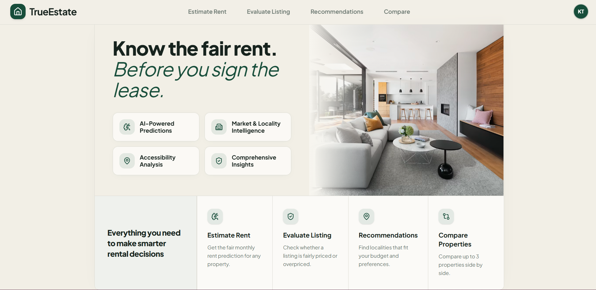

<div align="center">

<h1>&nbsp;TrueEstate</h1>

### Rental Intelligence, Beyond Price Prediction.

**An end-to-end machine learning platform that transforms property, market, and accessibility data into actionable rental decisions.**

<br>

`Machine Learning` · `XGBoost` · `FastAPI` · `Next.js` · `TypeScript` · `Supabase`

<br>

**Predict Fair Rent · Evaluate Listings · Discover Localities · Compare Properties**

<br><br>



</div>

<br>

---

<br>

## ◈ The Intelligence Layer for Rental Decisions

Finding a rental property is easy.

Understanding whether it is **fairly priced, well-connected, suitable for your budget, and better than the alternatives** is considerably harder.

**TrueEstate** is an ML-powered rental intelligence platform engineered to solve that problem.

Instead of treating rental valuation as a single prediction task, TrueEstate combines **machine learning, market intelligence, accessibility signals, valuation logic, and recommendation systems** to create a complete decision layer for renters.

> **TrueEstate does not simply estimate what a property should cost. It helps determine whether it is worth renting.**

<br>

---

<br>

## ◈ From Prediction to Decision Intelligence

Conventional rental prediction systems typically stop here:

```text
Property Details
      │
      ▼
   ML Model
      │
      ▼
Predicted Rent
```

TrueEstate extends that pipeline into a broader decision system:

```text
                         ┌─────────────────────┐
                         │   Property Details  │
                         └──────────┬──────────┘
                                    │
             ┌──────────────────────┼──────────────────────┐
             ▼                      ▼                      ▼
       Market Signals       Locality Intelligence   Accessibility Data
             │                      │                      │
             └──────────────────────┼──────────────────────┘
                                    ▼
                         ┌─────────────────────┐
                         │ ML Valuation Engine │
                         └──────────┬──────────┘
                                    ▼
                       Fair Rental Value Estimate
                                    │
                 ┌──────────────────┼──────────────────┐
                 ▼                  ▼                  ▼
          Listing Analysis    Value Scoring      Market Position
                 │                  │                  │
                 └──────────────────┼──────────────────┘
                                    ▼
                       Recommendation & Comparison
                                    │
                                    ▼
                         Rental Decision Insights
```

The output is not merely a prediction.

It is **context around the prediction — and intelligence for the decision that follows.**

<br>

---

<br>

## ◈ Core Intelligence

### 01 — ML Rent Estimation

TrueEstate estimates the expected monthly rental value of a property using physical characteristics, locality intelligence, engineered features, and market signals.

The prediction layer provides:

- Estimated monthly rent
- Expected rental range
- Predicted ₹/sq. ft.
- Locality market rate
- Locality + BHK market context
- Accessibility intelligence

<br>

### 02 — Listing Evaluation

A property's asking rent means little without market context.

TrueEstate compares the **asking rent against the model's estimated fair rental value** and determines the property's position relative to the expected market range.

The evaluation layer provides:

- Asking rent vs. fair rent
- Expected market range
- Absolute price difference
- Percentage deviation
- Market positioning
- Value-for-money scoring

<br>

### 03 — Locality Recommendation

The recommendation engine is designed around the renter rather than the listing.

Users can specify:

- Monthly budget
- Preferred city
- BHK requirement
- Property size
- Furnishing preference
- Accessibility priority

TrueEstate evaluates eligible localities and ranks them using **budget compatibility, market intelligence, and accessibility signals**.

<br>

### 04 — Property Comparison

Two properties with similar rents can represent very different value.

TrueEstate enables side-by-side comparison across:

- Asking rent
- Estimated fair value
- Price difference
- Predicted rental rate
- Market position
- Value score
- Accessibility score
- Nearby infrastructure

The comparison layer helps surface the option offering the **strongest overall balance of price, locality, and accessibility**.

<br>

---

<br>

## ◈ Accessibility as a First-Class Signal

Rental value is influenced by more than the property itself.

TrueEstate incorporates proximity to important surrounding infrastructure to provide additional locality context.

| Signal | Intelligence Captured |
|---|---|
| 🚇 **Transit** | Proximity to nearby transport infrastructure |
| 🏥 **Healthcare** | Distance to hospitals |
| 🏫 **Education** | Distance to schools |
| 🛍️ **Amenities** | Distance to malls and commercial infrastructure |

These signals contribute to an **Accessibility Score**, allowing properties and localities to be evaluated beyond rent alone.

<br>

---

<br>

## ◈ Engineering the Valuation Pipeline

TrueEstate's ML pipeline goes beyond passing raw property columns into a regression model.

The feature space combines property characteristics with engineered, locality-aware, and accessibility-aware signals.

```text
INPUT SPACE
│
├── Property Characteristics
│   ├── Area
│   ├── Bedrooms
│   ├── Bathrooms
│   ├── Balconies
│   ├── Property Type
│   └── Furnishing
│
├── Engineered Features
│   ├── Area per Bedroom
│   ├── Bathrooms per Bedroom
│   └── Balconies per Bedroom
│
├── Market Intelligence
│   ├── Locality Market Rate
│   ├── Locality + BHK Market Rate
│   └── City-Level Market Signals
│
└── Location Intelligence
    ├── Hospital Distance
    ├── School Distance
    ├── Mall Distance
    ├── Transit Distance
    └── Accessibility Score
                │
                ▼
        Feature Transformation
                │
                ▼
         XGBoost Valuation
                │
                ▼
       Predicted Rental Rate
                │
                ▼
         Fair Rental Value
```

The resulting model is exposed through a dedicated **FastAPI inference layer**, allowing the frontend and downstream intelligence services to consume predictions through a consistent API.

<br>

---

<br>

## ◈ System Architecture

TrueEstate follows a separated architecture where the user interface, application services, ML inference, and intelligence layers remain independently structured.

```text
┌───────────────────────────────────────────────────────┐
│                    USER EXPERIENCE                    │
│                                                       │
│             Next.js · React · TypeScript              │
└──────────────────────────┬────────────────────────────┘
                           │
                           │ HTTPS / JSON
                           ▼
┌───────────────────────────────────────────────────────┐
│                  APPLICATION LAYER                    │
│                                                       │
│                   FastAPI · Python                    │
└──────────────────────────┬────────────────────────────┘
                           │
             ┌─────────────┼─────────────┐
             │             │             │
             ▼             ▼             ▼
        Valuation     Recommendation   Comparison
         Service          Service        Service
             │             │             │
             └─────────────┼─────────────┘
                           │
                           ▼
┌───────────────────────────────────────────────────────┐
│                  INTELLIGENCE LAYER                   │
│                                                       │
│        XGBoost · Market Data · Accessibility Data     │
└───────────────────────────────────────────────────────┘

Authentication  →  Supabase + Google OAuth
Frontend        →  Vercel
Backend / ML    →  Render
```

<br>

---

<br>

## ◈ Technology Foundation

| Engineering Domain | Technology |
|---|---|
| **Machine Learning** | Python · XGBoost · Scikit-learn |
| **Data Processing** | Pandas · NumPy |
| **API & Services** | FastAPI · Uvicorn |
| **Frontend Engineering** | Next.js · React · TypeScript |
| **Interface System** | Tailwind CSS · Lucide |
| **Authentication** | Supabase Auth · Google OAuth |
| **Frontend Infrastructure** | Vercel |
| **Backend Infrastructure** | Render |
| **Version Control** | Git · GitHub |

<br>

---

<br>

## ◈ API Surface

TrueEstate exposes its intelligence capabilities through a focused REST API.

```http
POST /predict
POST /evaluate
POST /recommend
POST /compare

GET  /analyze/{city}/{locality}
GET  /health
```

Each capability remains separated at the service layer while sharing the underlying valuation and locality intelligence infrastructure.

<br>

---

<br>

◈ Supported Markets

<p>The current production system supports:</p>

<div align="center">

<table>
<tr>
<td align="center">

<br>


&nbsp;

&nbsp;


<br><br>

</td>
</tr>
</table>

</div>

Locality-level intelligence is used wherever sufficient data is available, while broader market signals support the valuation pipeline when locality-level information is limited.

<br>

---
## ◈ The Problem TrueEstate Solves

Property marketplaces are optimized for answering:

> **What properties are available?**

The harder questions come afterward.

> **Is ₹55,000 actually reasonable for this property?**

> **What should a similar property in this locality rent for?**

> **Am I paying a premium for this location?**

> **Could my budget get me a better-connected locality?**

> **Which of these properties represents stronger overall value?**

These decisions normally require users to manually interpret fragmented information across listings, maps, locality statistics, and surrounding infrastructure.

TrueEstate consolidates those signals into a single decision layer.

```text
Rental Data
     +
Market Context
     +
Accessibility
     +
Machine Learning
     ↓
Decision Intelligence
```

<br>

---

<br>

## ◈ Design Philosophy

TrueEstate was built around three engineering principles.

**Prediction should have context.**  
A predicted rent is significantly more useful when accompanied by market and locality intelligence.

<br>

**Location should be measurable.**  
Accessibility to important infrastructure should contribute to how a property is evaluated.

<br>

**Models should support decisions, not replace them.**  
The purpose of the ML layer is to convert complex rental information into structured, interpretable signals.

<br>

---

<br>

<div align="center">

## ◈ One Platform. One Rental Decision Layer.

### A rental decision should be informed by more than the asking price.

TrueEstate brings together **valuation, market context, accessibility, recommendations, and comparison** in a unified rental intelligence platform.

<br>

### **Predict less. Understand more. Rent smarter.**

<br>

<sub>Engineered with Machine Learning, FastAPI, Next.js and Supabase.</sub>

</div>
